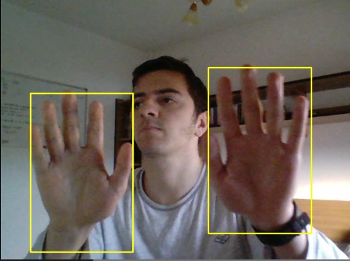
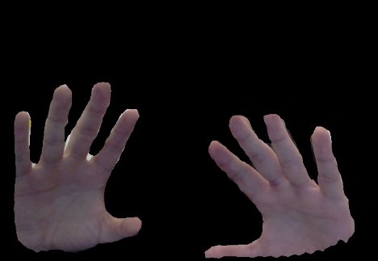

<h1>hand detection and segmentation</h1>

Researching detection/segmentation algorithms from PyTorch. 
Will probably include more details as well as the training scripts and data later on.

For now, everything is based on this PyTorch [tutorial](https://pytorch.org/tutorials/intermediate/torchvision_tutorial.html).

```shell script
pip install -r requirement.txt
```

<h2> Faster-RCNN</h2>

```shell script
python test_fasterrcnn_model.py webcam 
```


<h2> Mask-RCNN</h2>

```shell script
python test_maskrrcnn_model.py webcam
```



Also, see the `recordings` videos as well.